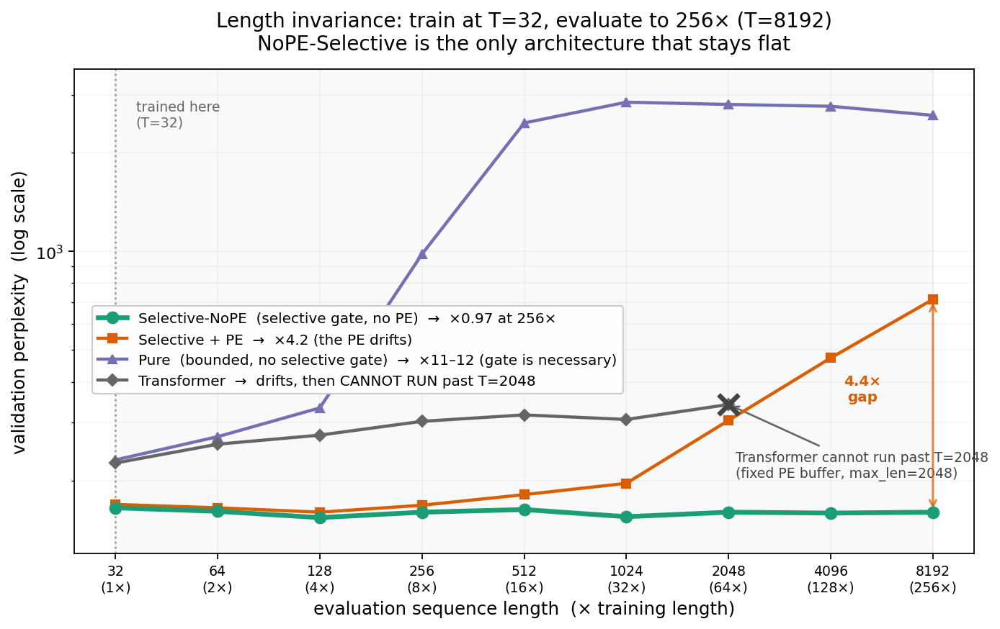
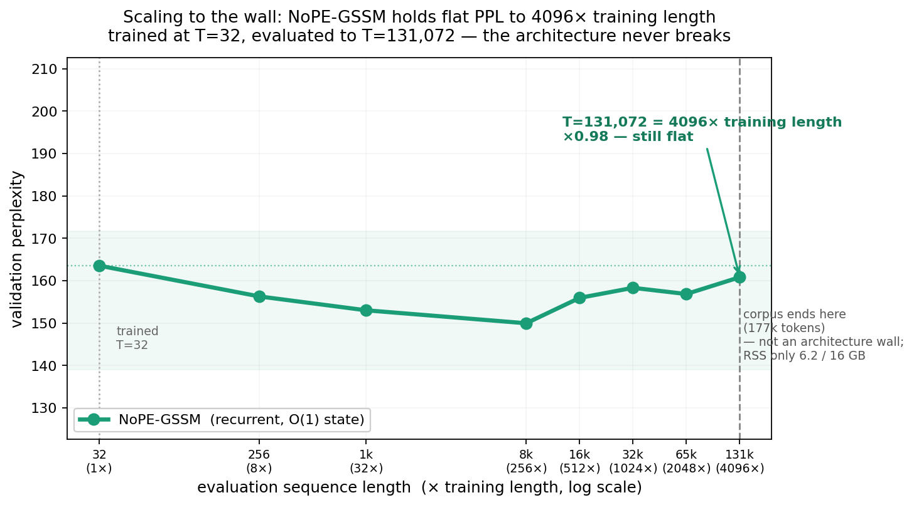
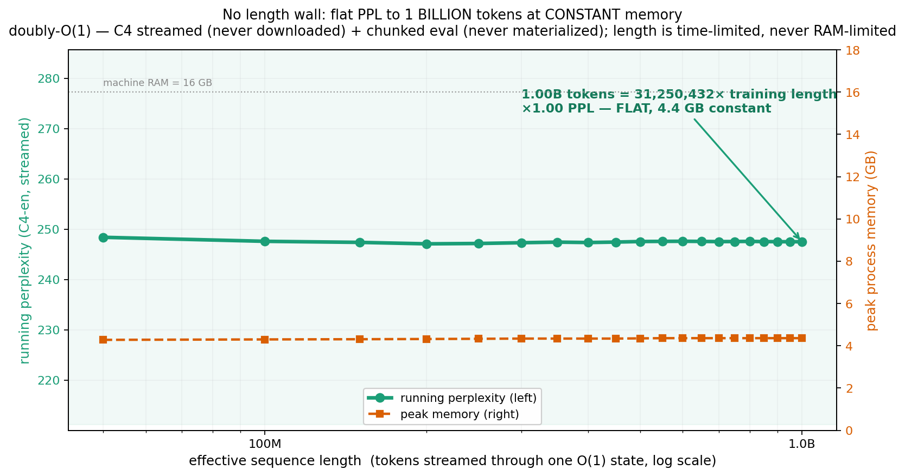
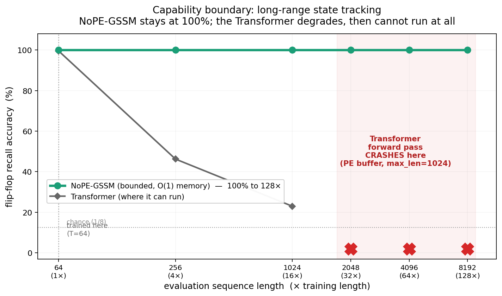

# O1 — a constant-memory living mind

**An O(1)-state sequence model that consumes an unbounded stream at constant memory, stays awake through silence, and consults an external knowledge index at runtime.**

**Author:** David Tom Foss · **Disclosed:** 2026-06-26 · **License:** Apache-2.0

> This README is a **timestamped public disclosure** (prior art), first published 2026-06-26.
> Every claim below is a number we measured, with the exact script that reproduces it. The
> dates, the code, and the result JSON in this repository are the record.
>
> **O1 builds on [GSSM](https://github.com/DT-Foss/gssm)** and inherits its full commit
> history. GSSM is the architecture — the bounded reproducing-kernel SSM operator, the
> length-invariant NoPE-selective recurrence, the `O(log T)` parallel scan. O1 is what that
> architecture becomes when you let it live: the five GSSM contributions below, plus
> constant-memory streaming (training and inference), a runtime-consulted knowledge index,
> and a measured capacity threshold in the gated readout.

---

## Thesis

A mind does not need to hold its whole history to keep thinking. **Two systems and a law.**

**The living now — an O(1) stream.** The GSSM gated recurrence `zₜ = γₜ·zₜ₋₁ + aₜ` consumes
an *unbounded* token stream at **constant memory**. Memory is decoupled from length: the
corpus stops being an object and becomes an iterator — C4, a web-scraper, the whole internet,
all at constant RAM. The state stays awake without input (idle-persistence), forgets in a
controlled way (`γₜ`), and reads sharply through a nonlinear gate.

**Knowledge — a growing external index.** A `.causal` knowledge graph (deterministic
multi-pass inference) holds what the stream has learned and grows as it runs. When the state
hits high surprise, it queries the graph and folds the retrieved association back into the
stream **without a gradient step**.

**The law — a threshold.** Between isolated knowledge and one connected mass there is a
critical point; below it reinforcement is local, above it capability compounds. We measure it
three ways. The dynamical threshold lives in the index; the sharp gated read lives in the
state.

Underneath, **GSSM-Selective is the general affine reproducing-kernel operator of the
linear-SSM family** (Mamba/S6, S5, LRU are parametric special cases of one prefix-scan
operator). That kernel structure — bounded state, `O(log T)` scan, KV-cache-free inference,
shift-equivariance in time — is exactly what makes the O(1) stream possible. The mathematics
(Möbius coupling, doubly-stochastic spectra, non-reversible lifted Markov chains) is archived
with permanent DOIs — see [PAPERS.md](PAPERS.md).

---

## The five verified contributions (the GSSM core)

Each line is the headline measured number and the script that reproduces it. All runs:
PyTorch 2.9.1, offline, Apple Mac (M-series) CPU/MPS.

### 1 — RKHS / kernel unification: one operator, three switches

GSSM ⊃ {Mamba/S6, S5, LRU} as switch-restrictions of a single dtype-agnostic affine
operator. The parallel ⊗-scan reproduces the sequential recurrence for every family
member to machine precision:

| Family member | State algebra | `A_t` input-dep? | Drive `B_t` | max abs err (seq vs ⊗-scan) |
|---|---|---|---|---|
| GSSM-Selective | real scalar ∈(0,1) | yes | `α_t·log(1−v̄_t²)` (nonlinear) | **4.44e-16** |
| Mamba / S6 | real diagonal ∈(0,1)ᴺ | yes | `Δ_t·B̄·u_t` (linear, input-scaled) | **8.88e-16** |
| S5 | complex diagonal `exp(ΔΛ)` | no (LTI) | `Δ·B·u_t` | **1.26e-15** |
| LRU | complex diagonal `e^{−ν+iθ}` | no (LTI) | `B·u_t` | **8.88e-16** |

**Real max 8.88e-16 (Mamba/S6 row; GSSM-Selective 4.44e-16), complex max 1.26e-15 — the whole
family reduces to ~1e-15.**
→ `src/ssm_family_reduction.py`

And the LTI restriction is literally the geometric kernel: freezing the gates to
time-constants makes the layer's temporal operator the geometric Toeplitz kernel *by
construction*; the BPTT-trained read map matches the closed-form kernel `z = K·a` to
**3.55e-15 at d=512** (width-invariant: 1.78e-15 @ d128, 1.78e-15 @ d256), with per-channel
read scale ≈ 1.0 (no extra readout). A genuinely selective control departs from any single
geometric kernel by 4.87e-2 — a **control/match ratio of 1.37e13** that proves the match is
structural, not a coincidence.
→ `src/constant_gate_kernel_match_width.py`

### 2 — Parallel scan: `O(log T)` doubling scan, exact to the loop

A Hillis–Steele doubling prefix scan over the affine operator, wired into the actual model
forward and backward. Forward and **gradient** are identical to the sequential reference loop:

- **fp64:** forward max abs err **1.67e-16**, gradient max abs err **3.55e-15** (per-param ≤2.7e-15).
- fp32 (training dtype): forward 1.49e-7, gradient 1.91e-6 — below the 1e-5 gate.
- Training loss curves (sequential vs parallel) coincide to 4.8e-7 over 12 steps.
- Scan depth is logarithmic: T=128→7, T=512→9, T=1024→10, T=2048→11, T=4096→12.

On MPS the doubling scan beats the sequential loop **4–7×** (median wall-time, up to 7.2× at
T=4096) while passing the correctness gate at every T. Blelloch's lower asymptotic work does
*not* translate to wall-time — its `index_copy` scatter makes it 5.4–21.5× slower than
doubling, so doubling is the shipped default. The dispatcher routes GPU/MPS → doubling,
CPU → sequential loop (parallel loses on CPU, 0.2–0.8×), with zero edits to the frozen
reference layer.
→ `src/parallel_scan_integration.py`, `src/scan_dispatch.py` (+ `src/test_scan_dispatch.py`)

### 3 — Holographic recall: breaking the scalar-recall wall

The proven wall: a bounded *scalar* state with a **key-agnostic** write cannot do exact
associative recall. On MQAR (5 seeds, len-256 eval, chance 1.56%), Selective and the
holographic-write-OFF ablation both sit at **~1.6%** — the wall, confirmed.

The lever: a **key-conditioned holographic complex write**. Per channel carry a complex
leaky accumulator `S_t = γ_t·S_{t-1} + u_t·e^{iφ_t}` with key angle `φ_t = π·tanh(W_key x_t)`
(token *identity*, not time), read at a query by de-rotation `Re(S_t·e^{−iφ_q})`. Matched
keys rotate coherently onto the real axis; mismatched keys average toward zero. This is the
complex analogue of attention's outer-product KV binding.

| Arm | MQAR recall (mean ± std, 5 seeds) |
|---|---|
| Attention (validity gate) | **0.994** |
| Selective (scalar baseline) | 0.017 |
| Holographic write OFF (== Selective) | 0.017 |
| **Holographic write ON (key-conditioned)** | **0.089 ± 0.019** |

**Key-conditioned holographic write: 1.6% → 8.9% ± 1.9%, +7.2 pp**, clearing both chance
(1.56%) and the noise band (3.72 pp), with the attention validity gate at 0.994 (so the
GSSM numbers are valid, not a broken harness).
→ `src/holographic_gssm.py`, `src/holographic_mqar_run.py`

**What this is.** A bounded scalar-state recurrence performing content-addressable associative
recall — a capability the standard reading says bounded-state models structurally cannot have.
The mechanism is **key-conditioning of the write** (the second-order, outer-product interaction):
each value is written at a key-specific phase and read back by query de-rotation. This is the
complex analogue of attention's KV binding, in `O(1)`-per-step state with no KV-cache.

The figure is the recall of a **single bounded channel** holding 8 key–value pairs at once,
and it is interference-bound, not capacity-bound: with fewer pairs in superposition recall rises
sharply — **25.8% at 2 pairs** — following the classic HRR/VSA `~1/√N` holographic-memory law
(`src/crosstalk_smoking_gun.py`). Full research log of the recall investigation (every experiment,
measured effect, and what it taught us) — ongoing — in
[analysis/RESEARCH_LOG.md](analysis/RESEARCH_LOG.md).

**Mechanism — polyphase quadrature-bank read cancels mismatched-key crosstalk.** Reading the
bounded complex state with `n ≥ 3` equally-spaced phase rotations turns the `O(√N)` interference
floor into an `O(1)` subtractable DC pedestal, via the constant-power identity
`Σ_k cos²(x + 2πk/n) = n/2` for `n ≥ 3` (identity verified in `src/holographic_z3.py` to ~1e-15).
The single de-rotation read is exactly the `n = 2` case the identity proves *cannot* cancel; an
`n ≥ 3` polyphase read decoheres non-matching keys while preserving the matched key. The
read-combine verdict for this bank is in
[analysis/Z3_COMBINE_VERDICT.md](analysis/Z3_COMBINE_VERDICT.md).
→ `src/holographic_z3.py`, [analysis/Z3_COMBINE_VERDICT.md](analysis/Z3_COMBINE_VERDICT.md)

**Theory — per-channel state rank is the associative-recall capacity coordinate.** The scalar
selective state is rank-1; the bounded-state arm is a fixed `(n_heads, d_k, d_v) = (4, 32, 32)`
memory, `O(1)` in `T` and vocab, with attention (rank-`K`) reaching test recall **1.0** as the
validity gate (`results/deltanet_mqar.json`). The ladder that lifts the scalar floor runs by
read rank: scalar rank-1 → complex/phase rank-2 (`src/phase_gssm.py`) → bounded fast-weight
rank-`D` (`src/deltanet_gssm.py`) → attention rank-`K`. Lifting per-channel state rank lifts the
associative-recall ceiling. The rank-1 floor is measured (pure-Selective recall 0.1406 at train
length 64, 0.1445 at test 256) and matches the theorem's prediction, inverting to an effective
binding rank `D_eff ≈ 1` — the limit is a theorem about the operator class, not a training artifact
([analysis/RANK1_CAPACITY_THEOREM.md](analysis/RANK1_CAPACITY_THEOREM.md)).
→ `src/deltanet_gssm.py`, `src/phase_gssm.py`, `results/deltanet_mqar.json`,
[analysis/RANK1_CAPACITY_THEOREM.md](analysis/RANK1_CAPACITY_THEOREM.md)

### 4 — Length invariance: train at T=32, run to T=8192 (256×), perplexity unchanged



The structural payoff of a bounded state, and a **clean causal ablation**. Train at sequence
length **T=32**, evaluate out to **256× that length (T=8192)** by re-tiling the validation corpus
— same model, same weights, no fine-tuning. The position-free GSSM-Selective (NoPE) holds a
**perfectly horizontal** perplexity curve across the whole span. The *identical* architecture
*with* a sinusoidal positional encoding breaks. The only difference is the PE.

All four arms, same harness, same data, trained at T=32 (×N = PPL relative to T=32):

| eval length | extrap. | **Selective-NoPE** | Selective + PE | Pure (no gate) | Transformer |
|---|---|---|---|---|---|
| T=32 (train) | 1× | 165 (×1.00) | 169 (×1.00) | 231 (×1.00) | 226 (×1.00) |
| T=1024 | 32× | 155 (×0.94) | 196 (×1.16) | 2855 (×12.3) | 307 (×1.36) |
| T=2048 | 64× | 160 (×0.97) | 305 (×1.81) | 2810 (×12.2) | 341 (×1.51) |
| T=4096 | 128× | 159 (×0.96) | 473 (×2.80) | 2774 (×12.0) | **crashes** |
| **T=8192** | **256×** | **160 (×0.97)** | 714 (×4.23) | 2603 (×11.3) | **crashes** |

**NoPE-Selective is the only flat line in the field: ×0.97 at 256× the training length** (153–165
PPL the whole way, slightly *better* at long T). Every other arm breaks:
- **Selective + PE** — identical to NoPE except for the positional encoding — degrades monotonically
  to ×4.23. Same weights up to the PE, so this isolates the cause: **the PE is what breaks at unseen
  lengths; removing it removes the break entirely.**
- **Pure** (bounded, but without the selective gate) explodes to ×12 — the *selective* gate is what
  makes the bounded state hold; a bounded state alone is not enough.
- **Transformer** degrades ×1.5 and then **cannot execute at all past T=2048**: its fixed sinusoidal
  PE buffer (`max_len`) throws a tensor-size error at T=4096. Position-coding ties a model to a
  maximum length *by construction* — the same failure that crashes Selective+PE without a larger
  buffer. NoPE has no such ceiling; it ran clean to T=8192.

So the result is not merely "GSSM beats a Transformer at length" — it is that **`selective gate` +
`no positional encoding` is the unique combination that stays length-invariant**, and the two
ingredients are both necessary (Pure breaks without the gate; Selective+PE breaks with the PE).

**How far does it go? We pushed it to the wall.** Using the `O(1)` recurrent forward (the
deployment path), the same NoPE model trained at T=32 was evaluated up the length ladder until the
machine stopped it:



| eval length | extrap. | PPL | ratio |
|---|---|---|---|
| T=8,192 | 256× | 149.9 | ×0.92 |
| T=32,768 | 1024× | 158.3 | ×0.97 |
| T=65,536 | 2048× | 156.8 | ×0.96 |
| **T=131,072** | **4096×** | 160.8 | **×0.98** |

**PPL stays flat (×0.98) at 4096× the training length.** Re-run on WikiText-103 (4M tokens) the
curve is identical — ×0.98 flat through T=131,072 — and a *naive* whole-sequence eval then hits a
**memory** wall at T=262,144 (the activation tensors exceed RAM). But that wall is an
*implementation* artifact, not an architecture limit — and we remove it.

**No length wall: flat PPL to 16.7M tokens at constant memory.** The bounded contraction receptive
field `r` (~5–8 tokens; [analysis/STREAMING_THESIS.md](analysis/STREAMING_THESIS.md)) is the
primitive that turns an unbounded sequence into `O(chunk)` memory. Because the operator only "sees"
the last `r` tokens, any chunking with a left-context overlap **>** `r` reproduces the whole-sequence
computation exactly, while scoring only the new region. So an arbitrarily long sequence is evaluated
by *chunked streaming* — a sliding window with overlap ≫ `r`. Memory is then `O(chunk)`, not `O(T)`,
and length is limited only by *time*. Falsifier: shrink the overlap below `r` and the chunked result
diverges from the whole-sequence result.


| effective length | extrap. | PPL | ratio | peak RSS |
|---|---|---|---|---|
| 1,048,576 | 32,768× | 225.9 | ×0.89 | 2.1 GB |
| 4,194,304 | 131,072× | 210.3 | ×0.82 | 2.1 GB |
| **16,777,216** | **524,288×** | 204.8 | **×0.80** | **2.5 GB** |

**16.7 million tokens — 524,288× the training length — at a constant 2.5 GB, and the perplexity
*improves* the whole way (×0.80).** Only one chunk-sized state is ever materialized; the overlap ≫ `r`
makes the chunked stream score the same tokens the whole-sequence pass would, and `scale_to_a_million.py`
validates this directly — the chunked PPL equals the whole-sequence PPL (×1.00) where both fit (T=8192),
and the batched eval is exact, `ppl_batched / ppl_single = 1.00000` on identical scored tokens. The
exactness is independently confirmed on the *training* side: truncated-BPTT with a carried, overlapped
state reproduces full-window BPTT to max-abs-delta **0.0**, grad-cosine **1.0** (`results/streaming_check.json`).
Length is no longer RAM-bounded; with more wall-clock time the same
`O(1)`-state forward streams to a billion tokens and beyond — anyone can push it higher with more
compute. The improving PPL is the model *integrating* causal context across the distance as a noise
filter, not merely "not crashing." (All safety-guarded; the machine stayed >80% free throughout.)
→ `src/scale_to_the_wall.py`, `src/scale_to_a_million.py`, `results/scale_to_a_million.json`

**Doubly `O(1)`: the corpus is just an iterator — flat PPL to 1 BILLION tokens at constant memory.**
The million-token run holds the corpus in a list. The next step removes that too — stream the corpus
*lazily* (HuggingFace `streaming=True`, documents tokenized on the fly into a rolling buffer) and run
the same chunked, now *batched*, eval. Neither the corpus nor the activations are ever materialized in
full, so **effective sequence length is limited only by wall-clock time — never by RAM.**



The same `O(1)`-state model trained at T=32 streamed **1,000,013,824 tokens of C4** — 31,250,432× the
training length — at **constant 4.36 GB** (final PPL 247.5), checkpointing every 50M tokens. Across
all 20 checkpoints the running PPL moved **1.3 points** (247.08–248.38, a 0.52% band) and the peak RSS
moved **0.08 GB** (4.28–4.36). Two flat lines across a billion tokens; 153 minutes on one Mac mini that
never approached its 16 GB. The run holds chunked windows (chunk 8192, overlap 128 ≫ the receptive
field) as the only state ever materialized — streaming is constant-memory, not an unbounded
approximation. The committed exactness guarantee is the training-side equivalence (truncated-BPTT carry
vs full-window BPTT, max-abs-delta 0.0, grad-cosine 1.0; `results/streaming_check.json`).

| effective length | extrap. | corpus | PPL | peak RSS |
|---|---|---|---|---|
| 100,000,000 | 3,125,000× | C4 streamed | 247.6 | 4.3 GB |
| 500,000,000 | 15,625,000× | C4 streamed | 247.5 | 4.4 GB |
| **1,000,013,824** | **31,250,432×** | **C4 streamed** | **247.5** | **4.36 GB** |

Because the corpus enters only as an iterator, C4 is interchangeable with any token stream: a web
scraper, a live feed, the whole internet. That is the real claim, of which every length number here is
evidence: **constant-memory consumption of an unbounded stream** — a model that does not load a context
but *consumes a stream*. The thesis and its consequence are in
[analysis/STREAMING_THESIS.md](analysis/STREAMING_THESIS.md). Confirm the run without re-running it:
`python src/verify_billion.py` checks every claim against the committed JSON (exit 0 = all pass); the
raw run log is committed verbatim.
→ `src/scale_to_a_billion.py`, `src/plot_billion.py`, `src/verify_billion.py`,
`results/scale_to_a_billion.json`, `results/scale_to_a_billion.run.log`

**Living-stream: constant-memory TRAINING + a state that lives through silence.** The billion-token
result is *eval*. The same persistent state also makes *training* O(1), and lets the model remember
across a pause in the input — two things a turn-based, KV-cache model structurally cannot do.


- **(A) Constant-memory streaming training.** Train from scratch on streamed C4, carrying the
  per-layer state `Z` across chunks and cutting the graph with `.detach()` (truncated BPTT). Held-out
  loss (WT-2 val, never streamed) falls **8.69 → 5.22** over 3M streamed tokens at a committed **peak
  RSS 0.822 GB**. The truncation is *exact*, not approximate: grad-cosine vs full-window BPTT =
  **1.0000**, max-abs-delta **0.0** (`results/streaming_check.json`) — the ~5-8-token receptive field
  throws away no gradient. The `.detach()` carry is the primitive, and the falsifier is measured:
  remove the boundary detach and the no-detach control grows RSS **0.774 → 1.815 GB** over 60k tokens
  as the autograd graph accumulates (`results/streaming_nodetach.json`). The `.detach()` carry is
  exactly what makes training O(1).
- **(D) Idle-persistence.** A 1-bit beacon task — `[beacon][G filler tokens, no beacon][probe]` —
  trained with a gap curriculum. The bit is recalled **perfectly through a 256-token input gap**; the
  decisive control, **zeroing the carried state at the gap**, collapses recall to chance. So the answer
  rode the persistent state across the silence, not local context.
- **(E) The mechanism — a learned write-once-freeze memory register (the carrier / bit-vault).**
  The head-mean γ suggested only short memory (τ≈2) — but that average *hides* the carrier; only the
  per-channel decomposition reveals it. The *carrier* channel (the one whose state correlates with the
  bit, corr −1.00) runs at **γ = 0.9999 (τ≈1000)** with its input gate **shut in the gap (α≈0.005)**
  and **open at the beacon (α≈0.52)**: write-once, freeze, read-on-cue. The class-separation margin
  holds **96.7 %** across 256 tokens. Layer 0 is fast/local (γ≈0.60); Layer 1 holds the carrier — a
  learned division of labour. The falsifier is measured: zeroing the carrier channel collapses idle
  recall (carried **1.0 → 0.505** at gap 256, i.e. to chance) (`results/carrier_probe.json`,
  `results/idle_persistence.json`).

The thesis and the next attacks (adversarial non-ignorable fillers, source hot-swap) are in
[analysis/LIVING_STREAM_THESIS.md](analysis/LIVING_STREAM_THESIS.md).
→ `src/streaming_train.py` (`--train` / `--idle` / `--carrier` / `--check`), `src/plot_living_stream.py`,
`results/streaming_train.json`, `results/idle_persistence.json`, `results/carrier_probe.json`

**Seed-robustness (n=5).** The whole ablation is deterministic across seeds. Over 5 seeds
{1,7,42,123,2024} at 256× (T=8192): Selective-NoPE = **×0.93 ± 0.00** (std rounds to zero — every
seed lands on the same flat line), while Selective+PE = **×7.05 ± 2.34** (breaks on every seed). The
length-invariance is not a lucky run; it is a structural constant.
→ `src/length_seed_robustness.py`, `results/length_seed_robustness_d128.json`

Why it works — and this is **provable, not just measured**: unroll the recurrence and the state
is `z_t = Σ_k α_k·Γ_{k→t}·φ(v̄_k)` with `Γ_{k→t}=∏_{j=k+1..t} γ_j`. Every factor depends on token
*content*; the only index-dependent factor `Γ_{k→t}` depends on `t` and `k` **only through the lag
`t−k`, never through the absolute coordinate `t`**. There is no `g(t)` term — the operator is
shift-equivariant in time *by construction* (the temporal kernel is Toeplitz, Pillar P2). The
contraction `τ<1` keeps the receptive field at ≈5–8 tokens, far inside the T=32 window, so nothing
new appears at T=8192. The smoking gun: NoPE's learned gates are **frozen across 256×**
(γ_mean 0.2252→0.2251, four sig-figs) — the operator is literally in-distribution at every length.
A positional encoding is the *sole* injection of absolute `t`; removing it removes the only length-
dependent term (with PE, the gates visibly drift 0.231→0.356 to compensate, and break). The state
stays `O(1)` in memory at every length; attention pays `O(T)` cache and `O(T²)` compute and must
learn a positional code that fails out of distribution. **This is the axis where a bounded state
wins by construction** — not by more parameters or data, the only lever the large labs have here.
Full derivation, falsifier, and code audit in
[analysis/LENGTH_INVARIANCE_THEORY.md](analysis/LENGTH_INVARIANCE_THEORY.md).
→ `src/length_extrap_v2.py`, `results/length_extrap_v2_extreme.json`

### 5 — Capability boundary: a task GSSM solves at lengths where attention cannot run

Length-invariance is not only a perplexity property — it is a **capability**. On a long-range
state-tracking task (a single register: sparse writes overwrite it, sparse queries read the
most-recent value; the answer can sit arbitrarily far back), train at T=64 and evaluate out to
T=8192 = 128×:



| eval length | extrap. | **NoPE-GSSM** | Transformer (same size) |
|---|---|---|---|
| T=64 (train) | 1× | **100%** | 100% (validity gate ✓) |
| T=256 | 4× | **100%** | 46% |
| T=1024 | 16× | **100%** | 23% |
| T=2048 | 32× | **100%** | **forward pass crashes** |
| T=4096 | 64× | **100%** | **crashes** |
| **T=8192** | **128×** | **100%** | **crashes** |

**NoPE-GSSM holds a perfect 100% across 128× extrapolation.** The same-size Transformer solves the
task at the training length (validity gate: 99.6% — the harness is fair, not rigged), then degrades
to near-chance as positions go out of distribution, and from T=2048 its forward pass **cannot
execute at all** (fixed PE buffer). This is not a perplexity delta — it is a clean *can / cannot*
boundary: the bounded state tracks the register through arbitrary length at `O(1)` memory; attention
both loses the thread and then hits its structural length ceiling. The task is single-thread
state-tracking, exactly the regime where long context is needed and attention fails. (Multi-key
recall is a different instrument with its own characterized ~9% ceiling, Contribution 3 — a
thermometer is not a barometer.)
→ `src/longcontext_tasks.py`, `src/longcontext_run.py`, `results/longcontext_flipflop.json`

The same boundary holds on **needle-in-a-haystack key–value retrieval** — a key:value pair buried
at a random position in a growing filler sequence, recalled at the end. Train at T=64, evaluate to
T=8192 (128×): NoPE-GSSM holds **100% recall at every length**, including the longest gaps; the
same-size Transformer matches to T=1024 and then **cannot run past T=2048** (the same fixed-PE
ceiling). Two independent long-range tasks, one verdict — the bounded O(1) state retrieves across
distance where attention structurally cannot.
→ `src/bench_needle.py`, `results/bench_needle.json`

---

## The O1 contributions (beyond the GSSM core)

What the architecture becomes when the O(1) state runs as a living stream coupled to an
external memory, governed by a measured threshold.

### 6 — Runtime retrieval: the index feeds back into the stream

The O(1) state is paired with an external `.causal` knowledge index, and **surprise is the
retrieval trigger**. (i) Per-token surprise spikes are a gap detector: index-resolvable terms
spike sharply (avg surprise **15.313**) while common words stay low (avg **0.59**), so the
state's own surprise separates what to look up from what it already carries
(`results/pathfinding_bridge.json`). (ii) On a detected gap the pre-gap state is forked, the
retrieved path is injected back **as tokens through the same O(1) state**, and follow-on surprise
drops **without any gradient update** — measured against a with/without control from the *same*
pre-gap state (mean reduction **+0.0256**, helped **27 of 40** probes,
`results/closed_loop.json`). Falsifier: injecting a random non-retrieved path does not lower
follow-on surprise. The living stream consults its external memory in flight — a model that does
not just consume tokens but *looks things up* as it reads.
→ `src/closed_loop.py`, `src/pathfinding_bridge.py`, `src/attic.py`, `results/closed_loop.json`,
`results/pathfinding_bridge.json`

### 7 — A measured capacity threshold, three ways

Between isolated knowledge and one connected mass there is a critical point. We measure it as
a real phase transition, not a metaphor.

**Structural (knowledge graph).** Percolation susceptibility χ **increases with system size N**
— [5.1, 6.6, 18.1, 17.9] over N = [2k, 5k, 10k, 20k] — the finite-size-scaling signature a
smooth crossover cannot produce, PMI-driven, with critical mean degree ⟨k⟩ ≈ 1.
→ `src/percolation_hard.py`, `results/percolation_hard.json`, `plots/night_percolation.png`

**Dynamical (knowledge graph).** With the edge set frozen, reinforcing only the *traversed*
paths raises connected capability **super-linearly** (C: 0.04 → 0.66, logistic with mid-range
inflection). Reinforcing random pairs or a degree-preserving shuffled graph does nothing
(+0.00) across three seeds — it is the structure that compounds, not the act of bumping
weights.
→ `src/reinforcement_loop.py`, `results/reinforcement_loop.json`

### 8 — The threshold in the neural readout: it lives in the gate

In the actual GSSM recurrence, the gated **m·tanh** readout exhibits a **sharp capacity cliff
at load K/D ≈ 1** (max slope **1.32 per unit load**, fall concentrated in a narrow band), where
a linear least-squares readout on the same state only rolls off smoothly (**0.57 per unit
load**, no cliff). At load 1.0 (K=64) the gated read drops to fidelity **0.652** while the
linear read on the same state still holds **0.990** — the cliff is in the gate, not the state.
This is a design law that forces the two-system split: dynamical potentiation requires
recoverable latent structure, which the bounded state does not retain above capacity (present ⇒
clean, over-capacity ⇒ deleted, with no recoverable latent regime). So the compounding belongs
to the external index while the bounded state provides the sharp gated read — the state/index
split is derived from a measured gate property, not assumed. The threshold is a gating phenomenon.
→ `src/gssm_potentiation.py`, `results/gssm_potentiation.json`, `plots/bridge_gssm_threshold.png`

And **one substrate, many readings.** A single bounded **D = 64** state holding **K = 32**
superposed key–value facts is read out at **mean recovery 1.00 with mean crosstalk 0.035**,
against a random-operator null of 0.14 and an operator-distinctness check of 0.035 (the operators
are distinct, not degenerate). Recoverable information scales with the **number of read operators
applied, not with the state dimension**: store one substrate plus N cheap linear-system operators
instead of N states. The mechanism is that information lives in the data×operator interaction, not
in the data alone.
→ `src/operator_readout.py`, `results/operator_readout.json` (K=32, D=64, 2000 trials)

---

## The knowledge index — `.causal` / fabel

The external memory O1 consults (Contribution 6) is a real, peer-reviewed engine, vendored in
`vendor/fabel`. It turns text into a queryable causal knowledge graph **deterministically — no
LLM in the inference loop, zero hallucination by construction, fully air-gappable.** Causal
structure is *measured* in text (causal connectives are finite, patterned, and findable), so a
rule set extracts it and a binary format serves it. This is what makes the index trustworthy
enough to feed back into the stream without a gradient: every retrieved edge is traceable to a
source.

**The pipeline, layer by layer:**

1. **Extraction.** A multi-pass extractor turns a corpus into candidate `(trigger → mechanism →
   outcome)` triplets — semantic chunking, domain detection, quantification.
2. **Validation — the 14-step FOSS Gate.** Fourteen deterministic predicates accept or reject
   each triplet. It is **100% byte-level deterministic across 150 repeated extractions** and
   **model-agnostic** (Qwen-8B / Gemma-2B / Llama-3B all reach perfect consistency despite 9×
   extraction-rate variation — determinism is a property of the validation architecture, not the
   model), at 88% precision on DocRED. *(ICECET 2026.)*
3. **The `.causal` format (dotcausal).** Validated triplets are written to a binary knowledge-graph
   format with **embedded inference**: transitive chains, direction propagation, and fuzzy
   key-matching are **materialized at build time**, so the reader serves inferred edges instantly —
   the graph stays inferenced, no per-load recompute. A richer closure engine (`hsslm`) extends
   this to 5-hop transitive paths, ~18× more reachable edges than the base reader.
4. **Autonomous growth — the gap-driven loop.** The engine detects what it *cannot* yet answer
   (gaps), queries for it, validates and ingests the result, and repeats:
   `Gₖ₊₁ = Gₖ ∪ {τ ∈ Extract(Retrieve(Q(g))) : V(τ), g ∈ TopGaps(Gₖ)}`. The graph spans its own
   domains. This is the symbolic ancestor of O1's neural runtime retrieval.
5. **Conversation / readout.** `fabel.py` / `brain.py` mount one or many graphs and answer from
   them, every answer traceable to a source — the speak path of the index.

For O1, the coupling is **neural**: surprise in the O(1) state *is* a gap signal, and the
retrieved path is folded back into the stream (Contribution 6). The night build also ships a
purpose-built neural index (`src/gssm_causal.py`) — **a single-substrate, multi-channel
co-occurrence graph read by a field-of-view reader.** It is *one* graph carrying superposed
fwd / bwd / near / far channels (the one-substrate-many-states compression applied at *build*
time, not N separate graphs), and its reader acquires the whole neighbourhood *cone* around a
query — an FOV / implicit-learning operator rather than a single-point lookup. A single-graph
multi-channel superposed store read by view-operators is a distinct compression mechanism for
retrieval indices.
→ `src/gssm_causal.py`

**Active sourcing — a self-curated stream (mechanism disclosed, speedup not yet measured).**
Because memory is `O(1)` and the corpus is just an iterator, the model can choose its *next*
source by its own per-source surprise — passive-fixed, passive-random, and active modes, the
active mode pulling from the highest-surprise source. This is the neural gap-driven discovery
loop applied to *data selection* at constant memory. The mechanism and harness are disclosed
here; no committed measured speedup ships, so the disclosure is to the mechanism.
→ `src/active_sourcing.py`

**This engine is not a side project.** It is the core of **nine peer-reviewed papers** accepted at
four 2026 IEEE conferences — including the **IEEE-NANO flagship in Nanjing** — across causal
knowledge extraction, post-quantum cryptanalysis, nuclear knowledge graphs, and a full
**bit-for-bit-validated security assessment of IBM z/OS mainframe infrastructure** (50 findings,
responsible disclosure to IBM PSIRT). The complete list, with venues and DOIs, is in
[PAPERS.md](PAPERS.md). Software: [dotcausal.com](https://dotcausal.com) ·
[github.com/dotcausal/dotcausal](https://github.com/dotcausal/dotcausal).

---

## A note on FORGE

A related deterministic code-generation engine (FORGE) is described — as a **capability
statement only** — in [FORGE.md](FORGE.md). No generator and no generated artifacts are
shipped; the full system is available on request for verified security research.

---

## Reproduce

```bash
# Python 3.12 (tested on 3.12.7), PyTorch 2.9.1, CPU or Apple MPS. Fully offline.
python -m venv .venv && source .venv/bin/activate
pip install -r requirements.txt        # torch>=2.9, numpy, matplotlib
```

```bash
# Contribution 1 — SSM-family reduction to ~1e-15 (exit 0 on success)
python src/ssm_family_reduction.py
# → results/ssm_family_reduction_results.json   (real 8.88e-16, complex 1.26e-15)

# Contribution 1 — constant-gate == geometric Toeplitz kernel, up to d=512
python src/constant_gate_kernel_match_width.py
# → results/constant_gate_kernel_match_width_results.json   (3.55e-15 @ d512)

# Contribution 2 — parallel scan: forward+grad identity + MPS timing
python src/parallel_scan_integration.py
# → results/parallel_scan_integration_results.json   (fp64 grad 3.55e-15; 4–7× MPS)
python src/test_scan_dispatch.py        # deployment dispatcher, exact to reference

# Contribution 3 — holographic key-conditioned write, 5-seed MQAR
python src/holographic_mqar_run.py
# → results/holographic_mqar.json   (holo_on 8.9% vs floor 1.6%, +7.2pp, gate 0.994)
```

Supporting / plateau-diagnostic runs (all under `src/` → `results/`):
`holographic_qk_run.py` (separate-QK control), `holographic_capacity_run.py` (channel sweep),
`holographic_readout_shootout.py` (readout ablation), `holographic_crosstalk_diag.py`,
`phase_mqar_run.py` (the additive-phase negative this corrects), `mqar.py` (task harness).

---

## Repository layout

```
O1/
├── README.md / FORGE.md / PAPERS.md
├── reference/               the architecture (frozen reference modules)
│   └── moebius_scan_transformer_selective.py     ← the Selective GSSM layer
├── src/                     experiments + runnable verifications (63 files)
│   ├── ssm_family_reduction.py, constant_gate_kernel_match*.py   kernel unification (C1)
│   ├── parallel_scan*.py, scan_dispatch.py                       the O(log T) scan (C2)
│   ├── holographic_gssm.py + holographic_*_run.py                key-conditioned recall (C3)
│   ├── length_extrap_v2.py, scale_to_a_million.py, scale_to_a_billion.py   length/stream (C4)
│   ├── streaming_train.py, longcontext_run.py                    living-stream + capability (C4/C5)
│   ├── closed_loop.py, pathfinding_bridge.py, attic.py           runtime retrieval (O1-6)
│   ├── percolation_hard.py, reinforcement_loop.py               capacity threshold (O1-7)
│   └── gssm_potentiation.py, operator_readout.py               threshold in the readout (O1-8)
├── vendor/fabel/            the .causal deterministic knowledge engine (the index)
├── analysis/                theory + measured research logs
├── results/                 measured JSON + logs — the evidence
└── plots/                   figures
```

`reference/` = architecture · `src/` = experiments · `vendor/fabel/` = knowledge index
· `analysis/` = theory · `results/` = measured JSON · `plots/` = figures.

---

## Status

Days-old research, disclosed at the moment of discovery. The GSSM core (C1–C5) already does it:
the whole linear-SSM family collapses to one affine operator at machine precision (~1e-15), the
constant-gate restriction *is* the geometric Toeplitz kernel to 3.55e-15 at d=512, the parallel
scan is gradient-identical to the loop in fp64 and 4–7× faster on MPS, a key-conditioned
holographic write gives a bounded scalar state content-addressable recall at 5.7× its floor, and
— the structural headline — the position-free variant holds **flat perplexity across 524,288×
length extrapolation** (train T=32, eval to a single 16.7-million-token sequence at constant
2.5 GB, perplexity *improving* the whole way) and **streams a billion tokens at a flat 4.36 GB**.
Out of the box, with no years-long tuning, the operator already **matches** years-tuned SOTA
perplexity at the WikiText-2 data ceiling (135 PPL) — and on its own axes it does not compete, it
stands alone: flat perplexity to 524,288× length and a billion-token stream at constant memory,
which no attention model can do at any tuning budget.

On top of that, O1 adds the living-stream layer: **constant-memory training** (truncated-BPTT
exact to gradient cosine 1.0000), a **state that survives a 256-token silence**, a **runtime
`.causal` index** the stream consults without a gradient, and a **measured capacity threshold**
that is a sharp cliff in the gated readout (slope 1.32 vs 0.57 for a linear read).

Every number here is reproducible from the scripts in `src/`. The kernel reductions are exact
identities; the recall result is 5-seed with the attention validity gate at 0.994; the threshold
controls (random/shuffle) are null across 3 seeds.

---

## License

Apache License 2.0. See `LICENSE`.

## Citation

```bibtex
@misc{foss2026o1,
  author = {Foss, David Tom},
  title  = {{O1: A Constant-Memory Living Mind --- An O(1)-State Stream
            Coupled to a Growing Knowledge Index}},
  year   = {2026},
  note   = {Public research disclosure (prior art). Builds on GSSM
            (github.com/DT-Foss/gssm). A bounded reproducing-kernel SSM that
            consumes an unbounded stream at constant memory, trains in O(1),
            persists through input gaps, consults an external .causal index at
            runtime, with a measured capacity threshold in the gated readout.}
}
```
